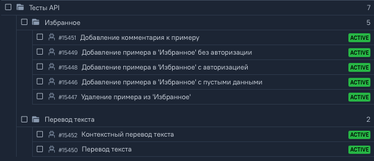
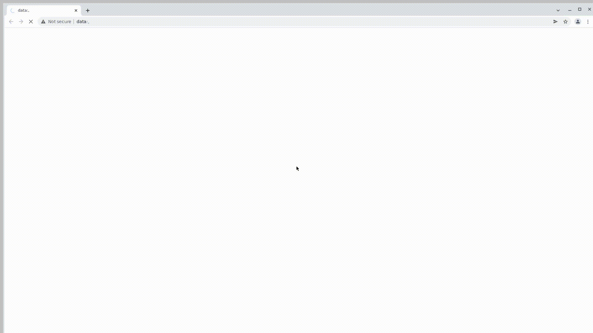

# <h2 align="center">Дипломный проект по автоматизации тестирования поисковой системы контекстного перевода текста [Reverso Context](https://context.reverso.net/translation/)</code></h2>
<p align="center">
<a href="https://context.reverso.net/translation/"></a>
</p>

## <a name="Содержание">Содержание</a>
- [Описание проекта и стек технологий](#Описание-проекта-и-стек-технологий)
- [Тест кейсы](#Тест-кейсы)
- [Команда Gradle для запуска тестов](#Команда-Gradle-для-запуска-тестов)
- [Параметры запуска](#Параметры-запуска)
- [Запуск в Jenkins](#Запуск-в-Jenkins)
- [Отчет о результатах тестирования в Allure Report](#Отчет-о-результатах-тестирования-в-Allure-Report)
- [Интеграция с Allure TestOps](#Интеграция-с-Allure-TestOps)
- [Уведомления в Telegram](#Уведомления-в-Telegram)
- [Примеры видео с прогоном тестов](#Примеры-видео-с-прогоном-тестов)

## <a name="Описание-проекта-и-стек-технологий">Описание проекта и стек технологий</a>
<p  align="center">


</p>

Дипломный проект состоит из 3х блоков: <code>UI-тесты веб-приложения</code>, <code>API-тесты веб-приложения</code> и <code>UI-тесты Android-приложения</code>
<p>При создании проекта использовалась среда разработки <code>IntelliJ Idea</code>, язык программирования <code>Java</code>, инструмент сборки проекта <code>Gradle</code>, тестовый фреймворк <code>JUnit5</code>.</p>
<p>Для написания веб UI-тестов использовалась библиотека <code>Selenide</code> с реализацией предусловий и постусловий через API-запросы, API-тестов - фреймворк <code>Rest Assured</code>, мобильных UI-тестов - библиотеки <code>Selenide</code> и <code>Appium</code>.</p>

Запуск UI-тестов выполняется:
>- локально: 
>>- для веб-приложения - в <code>браузере</code>, 
>>- для мобильного приложения - на эмуляторе Android-устройства с использованием <code>Appium Server</code>.
>- удаленно в <code>Jenkins</code>: 
>>- для веб-приложения - в <code>Selenoid</code> в изолированных Doker-контейнерах, 
>>- для мобильного приложения - в <code>Browserstack</code> на реальных Android-устройствах.
<p>Для визуализации результатов тестирования используются инструменты <code>Allure Report</code>, <code>Allure TestOps</code>, <code>Telegram Bot</code>.</p>

[Вернуться к оглавлению ⬆](#Содержание)

## <a name="Тест-кейсы">Тест кейсы</a>

#### <p align="center">**UI тест-кейсы для веб-приложения**</p>
<p align="center">

</p>

#### <p align="center">**API тест-кейсы для веб-приложения**</p>
<p align="center">

</p>

#### <p align="center">**UI тест-кейсы для мобильного Android-приложения**</p>
<p align="center">

</p>

[Вернуться к оглавлению ⬆](#Содержание)

## <a name="Команда-Gradle-для-запуска-тестов">Команда Gradle для запуска тестов</a>

Для запуска локально и в Jenkins используется следующая команда:
```bash
gradle clean <TASK>
-DenvironmentWeb=<ENVIRONMENT_WEB>
-DenvironmentMobile=<ENVIRONMENT_MOBILE>
-Dtestdata=<TEST_DATA>
```
[Вернуться к оглавлению ⬆](#Содержание)

## <a name="Параметры-запуска">Параметры запуска</a>

<code>TASK</code> – определяет набор тестов для запуска:
>- *test* (_по умолчанию_ - _запуск всех тестов_)
>- *UI_tests*
>- *API_tests*
>- *mobile_tests*
>- *translate_tests*
>- *favourites_tests*
>- *history_tests*
>- *auth_tests*
>- *menu_tests*

<code>ENVIRONMENT_WEB</code> – определяет окружение для запуска веб-тестов:
>- *chrome-local* (_по умолчанию локально_)
>- *firefox-local*
>- *chrome-v99-selenoid* (_по умолчанию в Jenkins_)
>- *chrome-v100-selenoid*
>- *firefox-v97-selenoid*
>- *firefox-v98-selenoid*

<code>ENVIRONMENT_MOBILE</code> – определяет окружение для запуска тестов мобильного приложения:
>- *google-pixel-4-v11.0-emulator* (_по умолчанию локально_)
>- *google-pixel-4-v11.0-browserstack* (_по умолчанию в Jenkins_)
>- *samsung-galaxy-S21-v11.0-browserstack*

<code>TEST_DATA</code> - определяет набор тестовых данных:
>- *data-quality-assurance* (_по умолчанию_)
>- *data-software-testing*

[Вернуться к оглавлению ⬆](#Содержание)

## <a name="Запуск-в-Jenkins">Запуск в Jenkins</a> 
Сборку проекта в Jenkins можно посмотреть [здесь](https://jenkins.autotests.cloud/job/016-anastasia_chernega-context_reverso.net_tests/).

Для запуска сборки необходимо:
>- перейти в раздел <code>Собрать с параметрами</code>,
>- выбрать параметры сборки,
>- нажать кнопку <code>Собрать</code>.

<p align="center">
  
</p>

После выполнения сборки, в блоке <code>История сборок</code> в поле информации о сборке появятся
значки:
>-  <code>Allure Report</code>
>-  <code>Allure TestOps</code>
<p> Нажав на них можно посмотреть результаты сборки.</p>

[Вернуться к оглавлению ⬆](#Содержание)

## <a name="Отчет-о-результатах-тестирования-в-Allure-Report">Отчет о результатах тестирования в Allure Report</a>
Пример отчета можно посмотреть [здесь](https://jenkins.autotests.cloud/job/016-anastasia_chernega-context_reverso.net_tests/18/allure/).

### Главная страница Allure Report

<p align="center">
  
</p>

### Отчет о результатах тестирования

<p align="center">
  
</p>

### Графики

<p align="center">
  
</p>

[Вернуться к оглавлению ⬆](#Содержание)

## <a name="Интеграция-с-Allure-TestOps">Интеграция с Allure TestOps</a>
Пример интеграции можно посмотреть [здесь](https://allure.autotests.cloud/launch/19873/tree?treeId=3740).

В <code>Allure TestOps</code> есть возможность:
>- наблюдать за выполнением тестов в реальном времени,
>- просматривать отчеты о прохождении тестов,
>- автоматически формировать тест-кейсы по результатам сборок,
>- выполнять из Allure Testops запуск тест-кейсов в Jenkins. 

### Ход выполнения тестов

<p align="center">
  
</p>

### Отчет о результатах тестирования 

<p align="center">
  
</p>

### Дашборды

<p align="center">
  
</p>

### Запуск из Allure Testops тест-кейсов в Jenkins

Для запуска тест-кейсов из <code>Allure TestOps</code> необходимо:
>- перейти в раздел <code>Test cases</code>,
>- выбрать тесты для прогона и нажать <code>Bulk actions</code> -> <code>Run</code>,
>- в появившемся окне <code>Run</code> перейти во вкладку <code>Jobs</code> нажать <code>Configure parameters</code>,
>- установить параметры запуска и нажать <code>Submit</code>. 

Значения параметров запуска необходимо выбрать в соответствии с разделом [Параметры запуска](#Параметры-запуска).
<br/>Параметры с пометкой local и emulator не используем - они предназначены для локального запуска.
<br/>Параметр <code>TASK</code> указывать не нужно, так как сборкой будут запускаться выбранные тест-кейсы.
<br/>Если не указать <code>остальные параметры</code>, то сборка будет запущена с дефолтными значенииями в Jenkins:
>- <code>TEST_DATA</code> – data-quality-assurance
>- <code>ENVIRONMENT_WEB</code> – chrome-v99-selenoid
>- <code>ENVIRONMENT_MOBILE</code> – google-pixel-4-v11.0-browserstack

<p align="center">
  
</p>

<p align="center">
  
</p>

[Вернуться к оглавлению ⬆](#Содержание)

## <a name="Уведомления-в-Telegram">Уведомления в Telegram</a>
После завершения сборки бот, созданный в <code>Telegram</code>, автоматически обрабатывает результаты тестов и отправляет в чат сообщение с отчетом о прохождении тестов и ссылкой на <code>Allure Report</code>.

<p align="center">

  
[Вернуться к оглавлению ⬆](#Содержание)

## <a name="Примеры-видео-с-прогоном-тестов">Примеры видео с прогоном тестов</a>

В отчетах <code>Allure Report</code> и в <code>Allure Testops</code> для каждого теста кроме скриншотов и логов, также прикрепляются видео с прохождением теста.

#### Видео прогона веб-теста в Selenoid (добавление примера контекстного перевода в Избранное)
  
<p align="center">
  
</p>

#### Видео прогона теста в мобильном приложении для Android в Browserstack (проверка контекстного перевода текста)
  
<p align="center">
  
</p>

[Вернуться к оглавлению ⬆](#Содержание)
